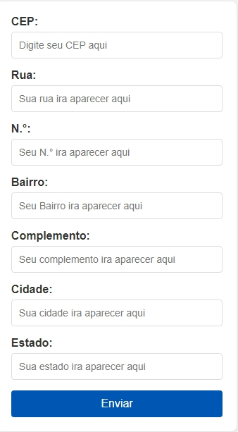

# Cadastro de Endereço ⚜️

## Descrição 📑

O Cadastro de Endereço é uma aplicação web interativa projetada para facilitar o registro de endereços através do uso de CEPs. Com uma interface simples e intuitiva, os usuários podem inserir um CEP e automaticamente visualizar os dados relacionados ao endereço, como rua, número, bairro, cidade e estado, poupando tempo e evitando erros manuais.

## Indice ⛓️ 
 
* [Descrição](https://github.com/Evellincruz/form-Cadendereco?tab=readme-ov-file#descri%C3%A7%C3%A3o-)
* [Tecnologias Utilizadas](https://github.com/Evellincruz/form-Cadendereco?tab=readme-ov-file#tecnologias-utilizadas-%EF%B8%8F)
* [Funcionalidades](https://github.com/Evellincruz/form-Cadendereco?tab=readme-ov-file#funcionalidades-)
* [Resumo da funcionalidade](https://github.com/Evellincruz/form-Cadendereco?tab=readme-ov-file#resumo-da-funcionalidade)
* [Explanção do código](https://github.com/Evellincruz/form-Cadendereco?tab=readme-ov-file#explan%C3%A7%C3%A3o-do-codigo)
* [Atributos diferencias no codigo JavaScript](https://github.com/Evellincruz/form-Cadendereco?tab=readme-ov-file#atributos-diferencias-no-codigo-javascript-)
* [Como usar](https://github.com/Evellincruz/form-Cadendereco?tab=readme-ov-file#como-usar-%EF%B8%8F)
* [Resultado](https://github.com/Evellincruz/form-Cadendereco?tab=readme-ov-file#resultado-%EF%B8%8F)
* [Referências](https://github.com/Evellincruz/form-Cadendereco?tab=readme-ov-file#refer%C3%AAncias)

## Tecnologias Utilizadas 🛠️

HTML5: Para a estruturação semântica da página.

CSS3: Para estilização e design responsivo (index.css).

JavaScript ES6: Para funcionalidades interativas e manipulação de dados (java.js).

API ViaCEP: Para consulta de dados de endereço através do CEP.

## Funcionalidades 📌

Entrada de CEP: Campo para o usuário inserir seu CEP.

Preenchimento Automático: Os campos de endereço são preenchidos automaticamente com base no CEP fornecido.

Validação de CEP: O sistema verifica se o CEP possui 8 dígitos e se contém apenas números.

Limpeza de Formulário: Campos são automaticamente limpos antes de um novo preenchimento.

Mensagens de Alerta: O usuário é notificado se o CEP inserido for inválido ou se não for encontrado.

# Resumo da funcionalidade 
 
O projeto basea-se em tornar mais pratico a realização de cadstro de endeço. Qual quando é digitado o cep preenche todo os outro campos como; bairro, cidade... mantando a padronização.
 
# Explanção do codigo
 
1.  Inicio:
    > - 'use strict'; ativa um modo de programação que evita erros comuns, garantindo que o código seja mais seguro.
 
2. Função limparFormulario:
 
    > Limpa os campos do formulário de endereço ao definir seus valores como vazios, utilizando getElementById.
 
 
3. Validação do CEP:
 
    > - Função eNumero: Verifica se o valor contém apenas dígitos numéricos usando uma expressão regular.
    >
    > - Função cepValido: Confirma se o CEP possui exatamente 8 dígitos e é numérico.
 
4. Função preencherFormulario:
 
    > Recebe um objeto endereco e preenche os campos do formulário com os dados correspondentes, como logradouro e bairro.
 
5. Função pesquisarCep:
 
    >- Assíncrona: Utiliza async/await para lidar com a API.
    >
    > - Limpa o formulário e monta a URL da requisição.
    >
    > - Verifica se o CEP é válido, faz uma requisição à API viaCep, e trata a resposta convertendo-a para JSON.
    > - Se o CEP não for encontrado, exibe um alerta; caso contrário, preenche o formulário.
 
6. Escutador de Evento:
 
    > - addEventListener é usado para chamar a função pesquisarCep quando o usuário sai do campo CEP (evento focusout: O evento focusout é acionado assim que o elemento perde o foco, no caso quando o usuário sai do campo de texto).
tem menu de contexto

# Atributos diferencias no codigo JavaScript ✨
 
- 'async function': O async function define uma função assíncrona, que retorna um objeto AsyncFunction. Ele é utilizado em linguagens de programação como o Java Scrypit.
 
- 'const': A declaração const cria uma variável cujo o valor é fixo, ou seja, uma constante somente leitura. Isso não significa que o valor é imutável, apenas que a variável constante não pode ser alterada ou retribuída.
 
- 'await': Quando utilizamos await, o JavaScript vai aguardar até que a promessa finalize. Caso ela seja finalizada com sucesso, o valor obtido é retornado.
 
- 'addres.hasOwnProperty': Resumo O método hasOwnProperty() retorna um booleano indicando se o objeto possui a propriedade especificada como uma propriedade definida no próprio objeto em questão (ao contrário de uma propriedade herdada).

## Como Usar ⚙️

Clone o repositório:

Copiar código
git clone: <https://github.com/Evellincruz/form-Cadendereco.git>

Abra o arquivo index.html em um navegador de sua escolha.

Insira o CEP desejado no campo apropriado.

Visualize os dados preenchidos automaticamente nos campos de endereço.

# Resultado ⚔️

## Referências

[ViaCEP](https://viacep.com.br/)
 
>foi usado o formato JSON para o projeto
 
[Mozilla](https://developer.mozilla.org/pt-BR/)
ViaCEP - Webservice CEP e IBGE gratuito
Webservice gratuito para consulta de endereço via CEP, suporta Ajax e retorno nos formatos JSON ou XML.
 
